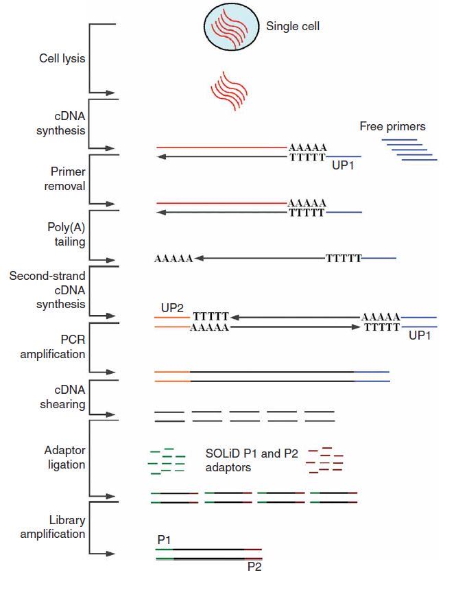
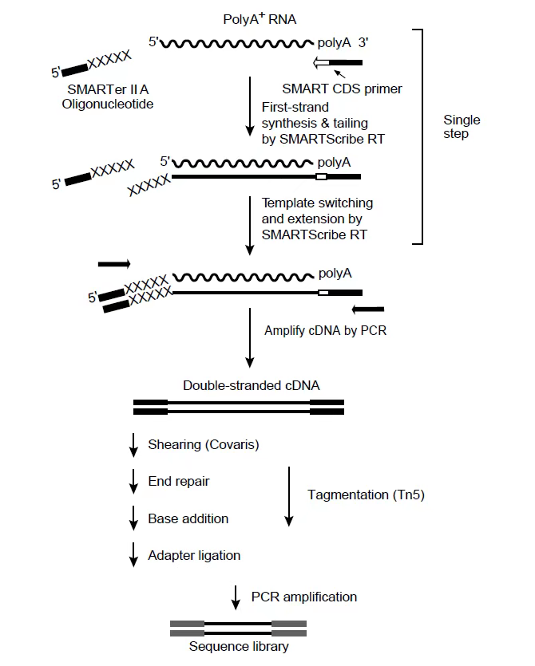

#单细胞转录组测序技术
> 阐明从基因型到表型的遗传调控，一直以来都是生物学领域的公认难题， 而解决这一难题行之有效的策略之一就是进行转录组分析。
>单细胞转录组测序技术的出现，极大地改变了转录组学研究，其可以实现单细胞水平解析基因表达，绘制出单细胞水平的基因表达谱。
>目前，单细胞转录组测序技术已经成为研究肿瘤细胞的异质性和细胞数量极少的早期胚胎发育阶段等生物学问题的得力工具。
>该技术可以揭示一些复杂而稀有的细胞群体，揭示一些细胞间基因表达差异性及基因间的调控关系，也可以跟踪发育中不同细胞谱系的轨迹。
##单细胞测序技术总体概述
>单细胞转录组测序技术主要由 5 个环节组成，包括**分离单细胞**、**细胞裂解**、**mRNA 逆转录**、**cDNA 扩增**、**测序**。
>其中，**mRNA逆转录**和 **cDNA 扩增**是该技术**最为关键的步骤**，因为单个细胞内的 mRNA 含量是极少的，需要扩增出可供检测的量，并且需要不偏倚地完整保留转录组信息。
>当前，根据捕获的转录本覆盖度，单细胞转录组测序技术主要可以分为两类：全长转录本测序技术以及 3’端/5’端转录本测序技术。全长转录本测序技术主要包括汤富酬团队开发的单细胞 mRNA-seq、Smart-seq、Smart-seq2、Smart-seq3。

>汤富酬团队开发的方法是先挑出单个细胞并直接裂解，然后在细胞裂解物中使用带有锚定序列（UP1）的 oligo-dT 引物将 mRNA 反转录为 cDNA，
>再通过核酸外切酶 I 去除游离引物，并通过末端脱氧核苷酸转移酶将 poly (A) 尾部添加至 cDNA 的第一条链的 3’末端，
>最后使用具有另一锚定序列（UP2）的oligo-dT 引物合成 cDNA 的第二条链，
>并使用 UP1 和 UP2 引物进行 PCR 扩增得到足量的 cDNA 以构建用于下一代测序的文库。

### mRNA-seq：
+ **细胞裂解**：在显微镜下人工吸取单个细胞并裂解
+ **cDNA合成**：带有锚定序列(UP1)的poly(T)引物将mRNA反转录成cDNA
+ **primer去除**：消化未使用的引物
+ **末端加尾**：将Poly(A)尾巴添加到cDNA第一链的3'端
+ **合成cDNA第二链**：使用带有另一个锚定序列(UP2)的ploy(T)引物合成第二链cDNA
+ **PCR扩增**：用UP1和UP2引物通过PCR均匀扩增cDNA
+ **cDNA打断**：将扩增后的cDNA打断
+ **加接头**：将P1和P2接头连接到打断的序列片段末端
+ **文库扩增**：将文库与共价连接P1引物的1mm直径beads混合进行乳液PCR(emulsion PCR：其实是一个注水到油的独特过程)

>_emulsion PCR_:
>乳液PCR的最大优势就是能够让低浓度DNA在独立反应空间，经过大量PCR循环使目的片段呈指数扩增，而没有其他的竞争性或污染性序列的影响。其关键技术是“注水到油”（水包油），基本过程是在PCR反应前，将包含PCR所有反应成分的水溶液注入到高速旋转的矿物油表面，水溶液瞬间形成无数个被矿物油包裹的小水滴。这些小水滴就构成了独立的PCR反应空间。理想状态下，每个小水滴只含一个DNA模板和一个磁珠。这些被小水滴包被的磁珠表面含有与接头互补的DNA序列，因此这些单链DNA序列能够特异地结合在磁珠上。同时孵育体系中含有PCR反应试剂，所以保证了每个与磁珠结合的小片段都能独立进行PCR扩增，并且扩增产物仍可以结合到磁珠上。当反应完成后，可以破坏孵育体系并将带有DNA的磁珠富集下来。经过反应，DNA模板的拷贝数量呈指数扩增，每个小片段都将被扩增约几百万倍，从而达到测序所要求的DNA量。

###Smart-seq
####SMART（Switching mechanism at 5’ end of the RNA transcript）是一个具有里程碑意义的重要技术。在2012年由美国和瑞典科学家共同开发，发表在《Nature Biotechnology》。作为一种单细胞测序方案，它能够在覆盖完整的转录本，能够在全基因组范围内挖掘调控网络，从而实现对单细胞转录组本异构体分析和SNA检测。尤其适用于对等位基因特异性表达或剪接变体的深入研究。
>+ Smart-seq 利用莫洛尼鼠类白血病病毒逆转录酶（Moloney Murine Leukemia Virus Reverse Transcriptase, MMLVRT）从单个细胞中生成并扩增全长 cDNA链。
>其中，模板转换和酶的末端转移酶活性尤为重要。当酶移动到 mRNA 的 5’ 末端时，该酶的末端转移酶活性向 cDNA 上添加一些非模板的胞嘧啶寡聚核苷酸序列。
>由于反应混合物中包含标记有鸟嘌呤残基的寡核苷酸，因此逆转录酶会切换模板并逆转录至寡核苷酸末端，从而完成建库用于测序。

###Smart-seq2
>>+ Smart-seq2 相对于 Smart-seq，使用了锁核酸（locked nucleic acid, LNA）、更高浓度的 MgCl2 以及甜菜碱，且产量更高，
>也是目前最常用的单细胞转录组测序技术之一。其原理是通过设计 oligo (dT) VN Primer 作为逆转录引物，利用MMLVRT 的模板转换活性，
>在 cDNA 的 3’端添加一段接头序列，通过该接头序列进行反转录，生成 cDNA 第一条链。当逆转录酶到达 mRNA 5’末端时，会连续在末端添加几个胞嘧啶（C）残基。
>然后添加 TSO 引物，退火后结合在第一条链的 3’端与 poly (C)突出杂交，合成第二条链。这样得到的 cDNA 经过PCR 扩增，
>获得纳克级的 DNA，纯化后可用于测序。

###Smart-seq3
>+ Smart-seq3 是对 Smart-seq2 的进一步升级，但未正式普及，其灵敏度有着显著提高，通常每个细胞能检测出更多基因，
>原理上的主要不同点是 Smart- seq3 在 PCR 预扩增后，再通过 Tn5 在 cDNA 中引入了近乎随机的切割，
>产生了 5' UMI 标签的片段和跨越整个基因体的内部片段。

>**SMART技术从少量或单个细胞进行cDNA扩增和文库制备：**
+ 首先在逆转录兼容缓冲液中裂解细胞，
+ 以polyA RNA为模板，然后用带接头的oligo(dT)为引物，在SMART逆转录酶（SMARTScribeTM Reverse Transcriptase）作用下，引发反应，合成一链。
+ 当合成到达模板的5'末端时，由于SMART逆转录酶具有末端转移酶活性，所以会在cDNA的3'末端增加几个碱基
+ 模板转换和掺入SMART er II A Oligonucleotide。（此时一段5'端带接头3'端与cDNA 3'末端延伸碱基反向互补的引物（SMARTer II A Oligonucleotide）与cDNA 3'末端延伸碱基进行互补配对）
+ 逆转录酶以该引物为模板继续延伸，得到两端带接头的完整单链cDNA序列，利用PCR扩增全长cDNA以获得几纳克的DNA。
+ 片段化，以生成测序文库。

参考[资源](http://www.biotrainee.com/)